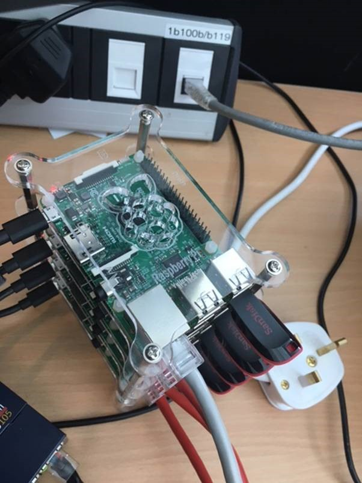

# HadoopRPi3
Contains scripts, settings files, pre-compiled pi Hadoop libraries and docs to setup a Hadoop cluster on a few Raspberry Pi 3 systems on a local network.

For step by step Instructions [click here](docs/HadoopRPi3-setup.txt) - Warning, these were instructions captured as I created this cluster. There may be errors - good luck!

## Hardware List

| # per cluster |	Item |	Link | £ per item |
| --- | --- | --- | --- |
| 4 |	RPi 3 |	[modmypi](https://www.modmypi.com/raspberry-pi/rpi3-model-b/raspberry-pi-3-model-b) |	£32.49 |
| 4	| 8Gb Micro SD | [amazon](https://www.amazon.co.uk/SanDisk-Imaging-microSDHC-Memory-Adapter/dp/B00MBTKT6S) | £3.68 |
| 1	| Ankur powerport 5 | [amazon](https://www.amazon.co.uk/Release-Anker-PowerPort-Charging-Multi-Port/dp/B00VTI8K9K) | £17.99 |
| 4	| 64Gb USB stick | [amazon](https://www.amazon.co.uk/SanDisk-Cruzer-Blade-Flash-Drive/dp/B00BX5FOCK) | £12.95 |
| 1	| Stackable case (outer) | [amazon](https://www.amazon.co.uk/Raspberry-Height-Adjustable-Stackable-Transparent-Vullers/dp/B00NB1WPEE) | £8.32 |
| 3 | Stackable case (middle) | [amazon](https://www.amazon.co.uk/Stacking-Raspberry-Vullers-Tech-G-RP-BPC/dp/B00NB1WQZW) | £8.27 |
| 4	| Micro USB cables | [amazon](https://www.amazon.co.uk/Anker-PowerLine-Micro-Premium-Cable/dp/B013I26P7S) | £3.99 |
| 1	| Network Switch | [amazon](https://www.amazon.co.uk/NETGEAR-GS105UK-Gigabit-Unmanaged-Ethernet/dp/B0000E5SEQ) | £19.97 |	
| 4 | Short Cat 5 cable | A Friend | £0.00 |

For the initial setup you'll also need a USB keyboard + HDMI cable + Monitor/TV. An additional network cable is also useful.

## Here's one I made earlier

